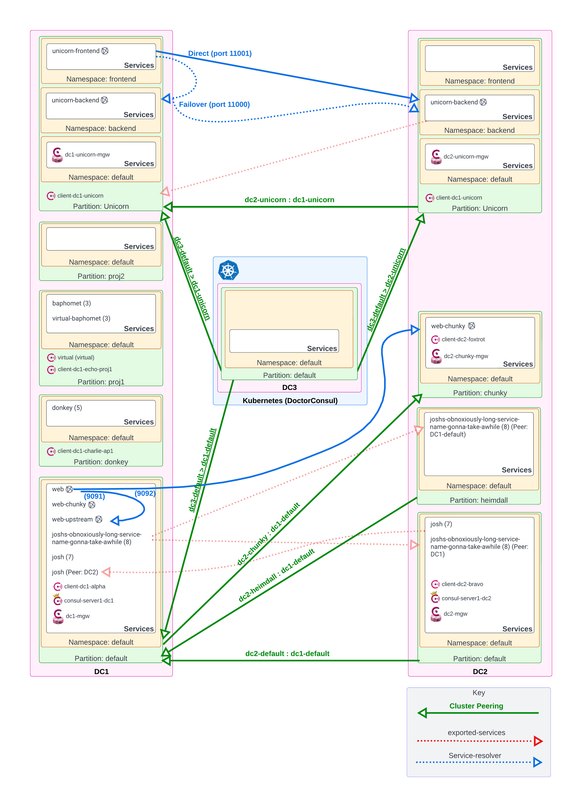

# HashiCorp Consul Docker-Compose Test Environment

This repo contains a full featured environment for setting up and testing HashiCorp Consul Enterprise.

It is a constant Work-in-progress.

Details:

* Heavy focus on implementing and testing the latest Consul features.
* Rapidly changing.
* Currently only configures Service Discovery
  * Mesh additions coming soon.
* [Doctor Consul Helper](https://github.com/joshwolfer/doctorconsul-helper) tool for easily collecting troubleshooting data.

### Software Versions used in this environment

* Consul: 1.14.2 (Enterprise)
* Envoy: 1.24.0
* FakeService: 0.24.2

### Software Versions used in this environment

Consul: 1.14.2 (Enterprise)
Envoy: 1.24.0
FakeService: 0.24.2

### Network Quick Chart

#### (DC1) Consul Core

* DC1 server: 10.5.0.2 / 192.169.7.2
* DC1 MGW: 10.5.0.5 / 192.169.7.3
* DC1 MGW (unicorn): 10.5.0.6 / 192.169.7.7

#### (DC1) Consul Clients

* consul-client-dc1-alpha (default):        10.5.0.10
* consul-client-dc1-charlie-ap1 (donkey):   10.5.0.11
* consul-client-dc1-delta-ap2 (unicorn):    10.5.0.12
* consul-client-dc1-echo-proj1 (proj1):     10.5.0.13

#### (DC1) Applications

* web-v1:                         10.5.0.100
* web-upstream:                   10.5.0.101
* unicorn-frontend:               10.5.0.110
* unicorn-backend:                10.5.0.111

#### (DC2) Consul Core

* DC2 server:                          10.6.0.2 / 192.169.7.4
* DC2 MGW:                             10.6.0.5 / 192.169.7.5
* DC2 MGW (chunky):                    10.6.0.6 / 192.169.7.6
* DC2 MGW (unicorn):                   10.6.0.7 / 192.169.7.8

#### (DC2) Consul Clients

* consul-client-dc2-bravo   (default):      10.6.0.10
* consul-client-dc2-foxtrot (chunky):       10.6.0.11
* consul-client-dc2-unicorn (unicorn):      10.6.0.12

#### (DC2) Applications

* web-chunky:                               10.6.0.100
* unicorn-backend:                          10.6.0.111

### Local Listeners

* Consul Server1 DC1 UI: http://127.0.0.1:8500/ui/
* Consul Server1 DC2 UI: http://127.0.0.1:8501/ui/
* Web Service UI: http://127.0.0.1:9000/ui
* Unicorn-frontend (unicorn) UI: http://127.0.0.1:10000/ui

#### Local Listeners for Envoy troubleshooting

* 19001: (dc1) gateway-dc1-unicorn
* 19002: (dc1) web
* 19003: (dc1) web-upstream
* 19004: (dc1) unicorn-frontend
* 19005: (dc1) unicorn-backend-dc1
* 19006: (dc1) gateway-dc1
* 19007: (dc2) gateway-dc2
* 19008: (dc2) gateway-dc2-chunky
* 19009: (dc2) gateway-dc2-unicorn
* 19010: (dc2) web-chunky
* 19011: (dc2) unicorn-backend-dc2

Architecture: (Needs to be updated to show new k3d cluster)


^^^ The Architecture now includes Mesh Gateways + Cluster Peering over Mesh Gateway. Picture will be updated in the future.

# Initialization Pre-Requirements

### Docker Compose

* Environment requires Docker-Compose
  * **!! MAC M1 USERS !!** : The Docker images referenced in the `docker-compose.yml` are AMD64, not ARM64.
  * M1 user will need to build your own ARM64 consul+envoy images using [https://github.com/joshwolfer/convoy-build](https://github.com/joshwolfer/convoy-build) and modify the `docker-compose.yml` file to reflect these new images.

### HashiCorp Consul Enterprise

* HashiCorp Consul Enterprise license required.
  * Place in `./license`
* Generate Consul PKI Root certs and Consul Server RPC certs
  * Self-signed certificates have already been provided in this repo.
  * If they need to be regenerated:
    * From within `./certs`
      ```
      consul tls ca create -days=3650
      consul tls cert create -server -dc=dc1 -additional-dnsname=consul-server1-dc1 -days=1825
      consul tls cert create -server -dc=dc2 -additional-dnsname=consul-server1-dc2 -days=1825
      chmod 644 *
      ```

### Auth0 (Optional)

* Create Auth0 account with appropriate configuration
  * Required only for the OIDC authentication in this Consul environment.
  * Details on how to do that will come later. For now reference this [Learn Guide](https://https://developer.hashicorp.com/consul/tutorials/datacenter-operations/single-sign-on-auth0?in=consul%2Fdatacenter-operations).
    * NOTE: The guide is outdated and Auth0 has since changed the locations for a few of the components. Everything is still possible to complete using this guide, but the locations of the config params are in different places on the leftside bar. Specifically:
      * `Applications` > `Applications` > Default
      * `Auth Pipeline` > `Rules`

### K3d

* K3d is a dockerized version of K3s, which is a simple version of Rancher Kubernetes.
* K3d is used for the platform Consul on Kubernetes portion of this environment.
* Installation instructions [HERE](https://github.com/k3d-io/k3d#get)

### Kubectl

### Helm

### k9s (Optional)

* Highly recommended to get k9s to make navigating Kubernetes a lot easier.
* [https://github.com/derailed/k9s/releases](https://github.com/derailed/k9s/releases)

# Instructions to Execute Environment

* Launch docker-compose environment:
  * `docker-compose up`
* Configure the core environment using the `post-config.sh` script:
  * `./post-config.sh`
* Build K3d Kubernetes cluster using the `k3d-config.sh` script:
  * `./k3d-config.sh`

# Tear down and Re-build Environment

* Delete all docker resources except the images:
  * `docker ps -a | grep -v CONTAINER | awk '{print \$1}' | xargs docker stop; docker ps -a | grep -v CONTAINER | awk '{print \$1}' | xargs docker rm; docker volume ls | grep -v DRIVER | awk '{print \$2}' | xargs docker volume rm; docker network prune -f`
  * `k3d cluster delete doctorconsul`
  * `docker-compose up`

# Architecture Overview

## Consul Servers

* 2x single-node Consul Clusters

### DC1 (VM)

* Servers (1)
  * `consul-server1-dc1`
  * UI exposed on local port 8500: `http://127.0.0.1:8500/ui/_default/dc1/services`
* Gossip Encryption: `aPuGh+5UDskRAbkLaXRzFoSOcSM+5vAK+NEYOWHJH7w=`

### DC2 (VM)

* Consul Servers (1)
  * `consul-server1-dc2`
* UI exposed on local port 8501: `http://127.0.0.1:8501/ui/_default/dc2/services`
* Gossip Encryption: `dznVKWl1ri975FUJiddzAPM+3eNP9iXDad2c8hghsKA=`

### DC3 (K3d Kubernetes)

* Servers (1)
  * `consul-server-0`
* UI exposed on local port 8502: `http://127.0.0.1:8502/ui/_default/dc3/services`
* Gossip Encryption: Randomly generated into a Kube secret.

## Consul Mesh Gateways

### DC1

* gateway-dc1
  * Internal listener: 10.5.0.5:443
  * Public listener: 192.169.7.3:443
* dc1-unicorn-mgw
  * Internal listener: 10.5.0.6:443
  * Public listener: 192.169.7.7:443

### DC2

* gateway-dc2
  * Internal listener: 10.6.0.5:443
  * Public listener: 192.169.7.5:443
* dc2-chunky-mgw
  * Internal listener: 10.6.0.6:443
  * Public listener: 192.169.7.6:443
* dc2-unicorn-mgw
  * Internal listener: 10.6.0.7:443
  * Public listener: 192.169.7.8:443

### DC3 (K3d)

* mesh-gateway
  * Kube loadbalancer: 192.168.7.9:8443 (NOTE! This is dynamically assigned, it could change...)

# Kubernetes (K3d)

* Local Kube API listner: 127.0.0.1:6443

## Admin Partitions & Namespaces

### DC1

* `default`
* `donkey`
* `unicorn`
  * `frontend` (NS)
  * `backend` (NS)
* `proj1`
* `proj2`

### DC2

* `default`
* `heimdall`
* `unicorn`
  * `frontend` (NS)
  * `backend` (NS)

## Cluster Peering Relationships & Exported Services

### Configuration

* Cluster Peering over Mesh Gateways enabled

### Peering Relationships

* `DC1`/`default` <> `DC2`/`default`
* `DC1`/`default` <> `DC2`/`heimdall`
* `DC1`/`unicorn` <> `DC2`/`unicorn`

### Exported Services

#### DC1

* `DC1`/`donkey(AP)/donkey` > `DC1`/`default(AP)` (local partition)
* `DC1`/`default(AP)/joshs-obnoxiously-long-service-name-gonna-take-awhile`>`DC2`/`default(AP)` (Peer)
* `DC1`/`default(AP)/joshs-obnoxiously-long-service-name-gonna-take-awhile`>`DC2`/`heimdall(AP)` (Peer)

#### DC2

* `DC2`/`default(AP)/josh`>`DC1`/`default` (Peer)
* `DC2`/`unicorn(AP)/unicorn-backend` > `DC1`/`unicorn` (Peer)

## HashiCorp Vault

Vault will eventually be implemented in the future as the Certificate Authority for the Consul Connect Service Mesh.

* The Vault server is currently commented out in the docker-compose file.

## Consul Clients

### consul-client-dc1-alpha (DC1)

* **DC**: `DC1`
* **Partition**: `default`
* **Services**:
  * `josh` (4 instances)
    * This `josh` service is exported to the `DC2` peer (`default`).
    * The `service.id` is `josh-local-x` to differentiate between this local service and the imported service (see Notes below)
  * `joshs-obnoxiously-long-service-name-gonna-take-awhile` (8 instances)
    * This `joshs-obnoxiously-long-service-name-gonna-take-awhile` service is exported to the `DC2` peer (`default`).
* **ACL Token**: `00000000-0000-0000-0000-000000001111`
  * `node-identity=client-dc1-alpha:dc1`
  * `service-identity=joshs-obnoxiously-long-service-name-gonna-take-awhile:dc1`
  * `service-identity=josh:dc1`
* **Notes**:
  * Within `DC1` and `DC2`, each cluster contains a service named `josh`.
  * This is intentional, as to test out the behavior of when a exported service from a peer matches the same name of a local service.
  * `DC1/default_AP/default_NS/josh` and `DC2/default_AP/default_NS/josh => DC1/default_AP/default_NS`
  * (Bug) As of 1.13.2, the UI cannot list the instances of both `josh` services by clicking on them.
    * Both links point to the imported `josh` only (bugged)
    * The UI URL can be manually manipulated to view the local `josh`: `http://127.0.0.1:8500/ui/_default/dc1/services/josh/instances`

### consul-client-dc1-charlie-ap1 (DC1)

* **DC**: `DC1`
* **Partition**: `donkey`
* **Services**:
  * `donkey` (5 instances)
* **ACL Token**: `root`
* **Notes**:

### consul-client-dc1-unicorn (DC1)

* **DC**: `DC1`
* **Partition**: `unicorn`
* **Services**:
  * `unicorn-frontend` (3 instances)
    * Namespace: `frontend`
  * `unicorn-backend` (3 instances)
    * Namespace: `backend`
* **ACL Token**: `root`
* **Notes**:

### consul-client-dc1-echo-proj1 (DC1)

* **DC**: `DC1`
* **Partition**: `proj1`
* **Services**
  * `baphomet` (3 instances)
* **ACL Token**: `root`
* **Notes**:

### virtual (DC1)

* **DC**: `DC1`
* **Partition**: `proj1`
* **Services**
  * `virtual-baphomet` (3 external instances)
* **Notes**:
  * This is a virtual node registered with the `post-config.sh` script.
  * It represents an externally registered service
  * Each `virtual-baphomet` service can be de-registered using the following commands:
    ```
    curl --request PUT --data @./configs/services-dc1-proj1-baphomet0.json --header "X-Consul-Token: root" localhost:8500/v1/catalog/register
    curl --request PUT --data @./configs/services-dc1-proj1-baphomet1.json --header "X-Consul-Token: root" localhost:8500/v1/catalog/register
    curl --request PUT --data @./configs/services-dc1-proj1-baphomet2.json --header "X-Consul-Token: root" localhost:8500/v1/catalog/register
    ```

### consul-client-dc2-bravo (DC2)

* **DC**: `DC2`
* **Partition**: `default`
* **Services**:
  * `josh` (7 instances)
* **ACL Token**: `root`
* **Notes**:
  * This `josh` service is exported to the `DC1` peer (`default`).

### consul-client-dc2-foxtrot (DC2)

* **DC**: `DC2`
* **Partition**: `chunky`
* **Services**:
  * `web-chunky` (in-mesh)
* **ACL Token**: `root`
* **Notes**:

# Consul Service Mesh Details

* Environment variables for the FakeService:
  * [https://hub.docker.com/r/nicholasjackson/fake-service](https://hub.docker.com/r/nicholasjackson/fake-servicehttps:/)

### Most useful FakeService Variables

#### Service Listener


| **Variable**              | **Meaning**                                                                             |
| --------------------------- | ----------------------------------------------------------------------------------------- |
| LISTEN_ADDR: 0.0.0.0:9090 | IP address and port to bind service to                                                  |
| MESSAGE: "Hello World"    | Message to be returned from service, can either be a string or valid JSON               |
| SERVER_TYPE: "http"       | Service type: [http or grpc], default:http. Determines the type of service HTTP or gRPC |
| NAME: "Service_name"      | Name of the service                                                                     |

### Fault Injection


| **Variable**             | **Meaning**                                                                              |
| -------------------------- | ------------------------------------------------------------------------------------------ |
| ERROR_RATE: "0"          | Decimal percentage of request where handler will report an error. (0.1 = 10% will error) |
| ERROR_TYPE: "http_error" | Type of error [http_error, delay]                                                        |
| ERROR_CODE: "500"        | Error code to return on error                                                            |

#### Upstream Settings


| **Variable**                         | **Meaning**                                           |
| -------------------------------------- | ------------------------------------------------------- |
| UPSTREAM_URIS: http://localhost:9091 | Comma separated URIs of the upstream services to call |
| HTTP_CLIENT_KEEP_ALIVES: "false"     | Enable HTTP connection keep alives for upstream calls |
| HTTP_CLIENT_REQUEST_TIMEOUT: "30s"   | Maximum duration for upstream service requests        |

# ACL Auth / Policies / Roles / Tokens

## ACL Tokens

#### Token: `root`

* Policy: `global-management`

#### Token: `00000000-0000-0000-0000-000000001111`

* Policies:
  * node-identity: `client-dc1-alpha:dc1`
  * service-identity: `joshs-obnoxiously-long-service-name-gonna-take-awhile:dc1`
  * service-identity: `josh:dc1`
* Purpose:
  * Agent token for Consul Client `consul-client-dc1-alpha` (DC1)

#### Token: `00000000-0000-0000-0000-000000002222`

* Role: `team-proj1-rw`
* Purpose:
  * Grant write permissions within `DC1` / `proj1` partition.

#### Token: `00000000-0000-0000-0000-000000003333`

* Role: `DC1-Read`
* Purpose:
  * Read-only privileges within the entire `DC1` cluster.

## Roles

#### Role: `consul-admins`

* Policy: `global-management`
* Purpose:
  * Assign root level permissions.
  * Used within the Auth0 OIDC method (group: `admins`) to define who should have "god mode" in the Consul Cluster

#### Role: `team-proj1-rw`

* Purpose: Grant write permissions within `DC1` / `proj1` partition.
* Used within the Auth0 OIDC method (group: `proj1`) to define who should have management permission of the `proj` partition

#### Role: `dc1-read`

* Purpose: Read-only privileges within the entire `DC1` cluster.

## OIDC Authentiction

### Auth0

#### Binding Rules

* auth0 groups = `proj1`
* auth0 groups = `admins`

# Enabled Features

### Core Cluster Config

* Consul Enterprise
* Admin Partitions Enabled
* Best-Practice Security Features Enabled
  * TLS encryption on all nodes.
  * TLS Verify on everything.
  * Gossip Encryption enabled.

### PKI / Certificates

* Auto encrypt enabled (automatic distribution of Consul Client RPC certificates)

### ACL / RBAC / Tokens

* `global-management` token defined as `root`
  * When in doubt use the `root` token.
* Most tokens and roles are scoped to the `default` partitions.
  * This is intentional, so all tokens are at the root hierarchy and can be scoped to managed any resource in any partition. (best-practices)

### Authentication

* OIDC Authentication enabled with Auth0

# Future Goals

### Key Architecture

* Add a local Kubernetes Consul cluster
  * Likely using minikube or k3s. Haven't decided.
* Add ECS cluster
  * Need to figure out how to expose local networking to ECS. This may not be practical for a DC lab. We'll see.

### PKI / Certificates

* Add Vault as the ConnectCA
* Use a unique CA keyset for each DC (`DC1` / `DC2`)
  * This is how separately managed clusters would work in the real world.

### Service Mesh

* Add FakeService applications working in the Consul Mesh.

### ACLs

* Mesh Gateways are currently using root ACL tokens - switch them to least privileges.

### Authentication Methods

* Add JWT authentication

### Metrics / Telemetry

* Add local UI metrics
  * I think this will require setting up a local prometheus pod.

# Staging Notes
