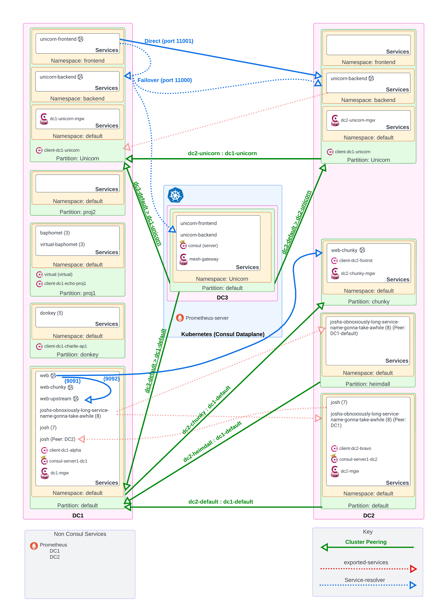

# Architecture Overview

Architecture:

## Consul Servers

* 3x single-node Consul Clusters (2 in VM, 1 in Kubernetes)

### DC1 (VM)

* Servers (1)
  * `consul-server1-dc1`
  * UI exposed on local port 8500: `http://127.0.0.1:8500/ui/_default/dc1/services`
* Gossip Encryption: `aPuGh+5UDskRAbkLaXRzFoSOcSM+5vAK+NEYOWHJH7w=`

### DC2 (VM)

* Consul Servers (1)
  * `consul-server1-dc2`
* UI exposed on local port 8501: `http://127.0.0.1:8501/ui/_default/dc2/services`
* Gossip Encryption: `dznVKWl1ri975FUJiddzAPM+3eNP9iXDad2c8hghsKA=`

### DC3 (K3d Kubernetes)

* Servers (1)
  * `consul-server-0`
* UI exposed on local port 8502: `http://127.0.0.1:8502/ui/_default/dc3/services`
* Gossip Encryption: Randomly generated into a Kube secret.

## Consul Mesh Gateways

### DC1

* gateway-dc1
  * Internal listener: 10.5.0.5:443
  * Public listener: 192.169.7.3:443
* dc1-unicorn-mgw
  * Internal listener: 10.5.0.6:443
  * Public listener: 192.169.7.7:443

### DC2

* gateway-dc2
  * Internal listener: 10.6.0.5:443
  * Public listener: 192.169.7.5:443
* dc2-chunky-mgw
  * Internal listener: 10.6.0.6:443
  * Public listener: 192.169.7.6:443
* dc2-unicorn-mgw
  * Internal listener: 10.6.0.7:443
  * Public listener: 192.169.7.8:443

### DC3 (K3d)

* mesh-gateway
  * Kube loadbalancer: 192.168.7.9:8443 (NOTE! This is dynamically assigned, it could change...)

# Kubernetes (K3d)

* Local Kube API listener: 127.0.0.1:6443